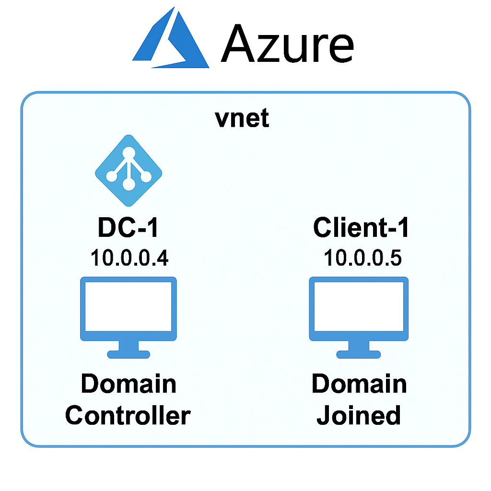

  

 

# Active Directory Lab on Azure

This project showcases the setup of a Windows Server Active Directory environment on Microsoft Azure. It involves deploying a Domain Controller (DC) and a Client (PC), joining the client to the domain, creating user accounts, and ensuring the user accounts can log on successfully with proper connectivity and remote access.

## Technologies Used
- Microsoft Azure
- Windows Server 2019
- Windows 10 Pro
- Active Directory Domain Services
- PowerShell
- RDP

## Architecture
- **Virtual Network**: 10.0.0.0/16
- **DC-1**: Windows Server 2019 (Domain Controller)
- **Client-1**: Windows 10 Pro (Domain Joined)
 

  

---

## Setup Steps

### 1. Setting Up Resources in Azure

**Create Domain Controller VM**
- **Name**: `DC-1`
- **OS**: Windows Server 2022
- **Resource Group**: Use a new or existing one
- **Virtual Network (VNet)**: Create a private VNet or use an existing one

**Configure Network Settings**
- Set `DC-1`'s private IP address to static

**Create Client VM**
- **Name**: `Client-1`
- **OS**: Windows 10
- Use the same Resource Group and VNet as `DC-1`

**Verify Network Connectivity**
- Ensure both VMs are in the same VNet
- Use **Azure Network Watcher** to verify private IP connectivity between `DC-1` and `Client-1`

### 2. Promoting the Domain Controller

**Set Static IP on DC-1**
- Assign the static IP to `DC-1` via NIC settings

**Install AD DS Role**
- Use **Server Manager** or **PowerShell** to install the Active Directory Domain Services role

**Promote to Domain Controller**
- Create a new forest (e.g., `af.midroam.com`)
- Restart the server when prompted

### 3. DNS Configuration

**Ensure DNS is Configured Properly**
- `DC-1` becomes the DNS server
- On `Client-1`, update DNS settings to point to `DC-1`'s IP address

### 4. Creating an Additional Admin User

- On `DC-1`, open **Active Directory Users and Computers**
- Create a new user (e.g., `azureadmin`)
- Add the user to the **Domain Admins** group

### 5. Joining Client-1 to the Domain

- Log in to `Client-1` using the local admin account
- Join the PC to the domain (e.g., `af.midroam.com`)
- Restart `Client-1`

### 6. Configuring Remote Desktop Access

- Enable Remote Desktop on both VMs
- Add domain users to the **Remote Desktop Users** group (on `Client-1`)
- Ensure appropriate NSG rules and firewall settings allow RDP access

### 7. Creating and Testing Standard User Accounts

**Create Non-Administrative Users**
- In ADUC, create users (e.g., `john.doe`, `jane.doe`)

**Verify Successful Logon**
- Use Remote Desktop to log in to `Client-1` with the newly created users
- Confirm successful domain login and access rights

---

> 💡 *Note: It's best practice to create subdomains (e.g., `lab.yourdomain.com`) from your registered domain for internal use, as recommended by Microsoft and industry standards.*

---

## Screenshots

| Domain Join Success | GPO Result | Shared Folder Access |
|---------------------|------------|-----------------------|
|  |  |  |

---

## Lessons Learned

- Importance of DNS resolution in domain joining
- Troubleshooting Group Policy using `gpresult`
- Secure access and delegation using OUs and GPOs
- Differences between local and domain permissions

---

## Next Steps / Ideas for Improvement

- Add a second Domain Controller for redundancy
- Integrate Azure AD or hybrid configuration
- Automate entire setup using Terraform or ARM templates
- Explore user login scripts and software deployment via GPO

---

## Acknowledgments

This lab was inspired by real-world scenarios and Microsoft documentation on Active Directory and Azure VM networking.

---

## License

This project is open source and available under the [MIT License](LICENSE).

