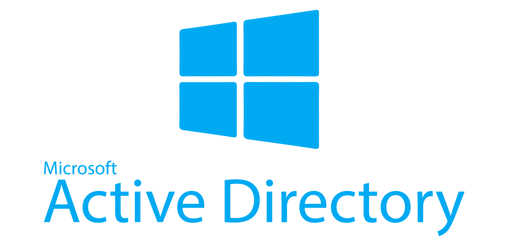

  

 

# Active Directory Lab on Azure

This project showcases the setup of a Windows Server Active Directory environment on Microsoft Azure. It involves deploying a Domain Controller (DC) and a Client (PC), joining the client to the domain, creating user accounts, and ensuring the user accounts can log on successfully with proper connectivity and remote access.

## Technologies Used
- Microsoft Azure
- Windows Server 2019
- Windows 10 Pro
- Active Directory Domain Services
- PowerShell
- RDP

## Architecture
- **Virtual Network**: 10.0.0.0/16
- **DC-1**: Windows Server 2019 (Domain Controller)
- **Client-1**: Windows 10 Pro (Domain Joined)
 

  

## Key Steps
- Provisioned VMs in Azure with a private virtual network.
- Set static IP and promoted DC-1 to a Domain Controller.
- Configured the DNS on the client PC to point to DC-1’s IP.
- Joined Client-1 machine to the domain (DC-1).
- Created user accounts and ensured successful logon via remote access.

---

## Setup Steps Summary

1. **Provision Azure VMs:**
   - Create `DC-1` (Windows Server 2019)
   - Create `Client-1` (Windows 10 Pro)
   - Ensure both are in the same virtual network and subnet

2. **Configure DC-1:**
   - Assign static private IP
   - Install AD DS role via PowerShell or Server Manager
   - Promote to Domain Controller with a new forest `af.midroam.com`

3. **Configure Client-1:**
   - Point DNS to DC-1’s private IP
   - Join domain using domain admin credentials
   - Restart to complete domain join

4. **Active Directory Tasks:**
   - Create OUs: `_ADMINS`, `_EMPLOYEES`
   - Create users and assign to OUs
   - Add new admin to `Domain Admins` group

5. **Group Policy Tasks:**
   - Create and link GPO to `EMPLOYEES` OU
   - Configure User Configuration policies (e.g., remove programs, enable screensaver)
   - Use `gpupdate /force` and `gpresult /r` to verify

6. **Shared Folder Setup:**
   - Create a shared folder on DC-1 or another file server
   - Set NTFS and Share permissions for specific users or groups
   - Access via UNC path from client PC (`\\DC-1\SharedFolder`)

---

## Screenshots

| Domain Join Success | GPO Result | Shared Folder Access |
|---------------------|------------|-----------------------|
|  |  |  |

---

## Lessons Learned

- Importance of DNS resolution in domain joining
- Troubleshooting Group Policy using `gpresult`
- Secure access and delegation using OUs and GPOs
- Differences between local and domain permissions

---

## Next Steps / Ideas for Improvement

- Add a second Domain Controller for redundancy
- Integrate Azure AD or hybrid configuration
- Automate entire setup using Terraform or ARM templates
- Explore user login scripts and software deployment via GPO

---

## Acknowledgments

This lab was inspired by real-world scenarios and Microsoft documentation on Active Directory and Azure VM networking.

---

## License

This project is open source and available under the [MIT License](LICENSE).

